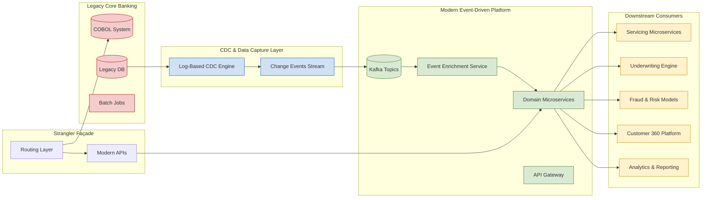

# Core‑to‑Modern Coexistence Architecture

## Summary

This coexistence architecture enables progressive modernization of legacy core banking systems without disrupting business operations. It uses:

- **CDC (Change Data Capture)** to stream real-time changes from legacy cores  
- **Event-driven architecture** to power underwriting, servicing, fraud, and analytics  
- **Strangler façade** to gradually shift traffic from legacy APIs to modern microservices  
- **Dual-write and dual-read patterns** during migration  
- **Canonical events** to unify data models across lending domains  

This model was used to modernize 77+ legacy lending applications and forms the foundation for the Core Lending Modernization Patterns library.

